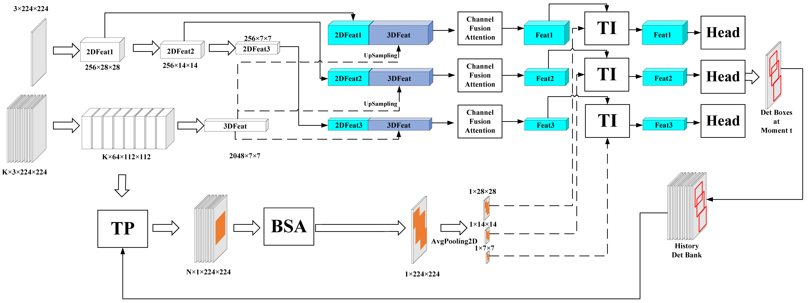

#You Can Only Watch the Past：Track Attention Network for Online Spatio-Temporal Action Detection

## Overview of TAN



## Requirements
- We recommend you to use Anaconda to create a conda environment:
```Shell
conda create -n tan python=3.6
```

- Then, activate the environment:
```Shell
conda activate tan
```

- Requirements:
```Shell
pip install -r requirements.txt 
```

## Visualization

# Dataset

## UCF101-24:
You can download **UCF24** from the following links:

* Google drive

Link: https://drive.google.com/file/d/1Dwh90pRi7uGkH5qLRjQIFiEmMJrAog5J/view?usp=sharing

* BaiduYun Disk

Link: https://pan.baidu.com/s/11GZvbV0oAzBhNDVKXsVGKg

Password: hmu6 

## Train TAN
* UCF101-24

For example:

```Shell
python -m torch.distributed.launch --nnodes 1 --nproc_per_node 2 train.py --cuda -d ucf24 --data_root /data1/su/datasets/UCF24-YOWO/ -bs 32 -tbs 16 -K 16 -accu 8 -v yowo_v3_large --max_epoch 7 --lr_epoch 2 3 4 5 --eval -ct 0.05 --distributed --sybn (--resume weights/ucf24/yowo_v3_large/yowo_v3_large_epoch_1.pth) (--untrimmed_trainning) (--track_mode)
```

##  Test TAN
* Frame-mAP：

```Shell
python eval.py --cuda -d ucf24 --data_root /data1/su/datasets/UCF24-YOWO/ -tbs 16 -v tan_large --weight weights/ucf24/tan_large/tan_large_epoch_0.pth -ct 0.05 --cal_frame_mAP
```
* Video mAP：

```Shell
python eval.py --cuda -d ucf24 --data_root /data1/su/datasets/UCF24-YOWO/ -tbs 16 -v tan_large --weight weights/ucf24/tan_large/tan_large_epoch_0.pth -ct 0.05 --cal_video_mAP --link_method viterbi
```